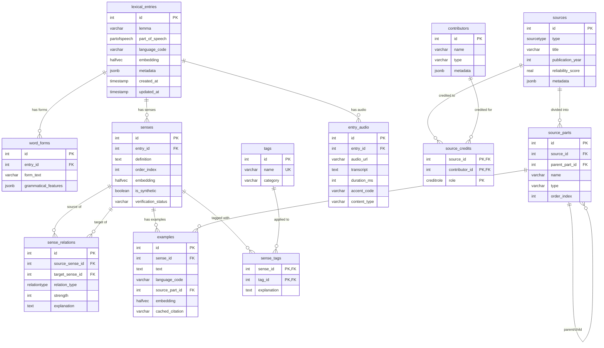

# Dictionary Database Schema

> **Source**: `lib/db/neon/schemas/dictionary.ts`
> **Stack**: Neon (Postgres 17) + Drizzle ORM + pgvector 0.7+ + pg_trgm

## Entity Relationship Diagram



---

## Architecture Overview

```
┌─────────────────────────────────────────────────────────────────────────────┐
│                           LEXICAL DOMAIN                                    │
│  ┌──────────────────┐                                                       │
│  │ lexical_entries  │──┬──────────────────┐                                 │
│  │  (lemma, POS)    │  │                  │                                 │
│  └────────┬─────────┘  │                  │                                 │
│           │            │                  │                                 │
│           ▼            ▼                  ▼                                 │
│  ┌────────────┐  ┌──────────┐     ┌─────────────┐                           │
│  │ word_forms │  │  senses  │◄───►│sense_relations│ (synonyms, antonyms,    │
│  │ (ran, runs)│  │(meanings)│     │              │  translations, etc.)     │
│  └────────────┘  └────┬─────┘     └──────────────┘                          │
│                       │                                                     │
│              ┌────────┼────────┐                                            │
│              ▼        ▼        ▼                                            │
│        ┌──────────┐ ┌────┐ ┌──────────┐                                     │
│        │ examples │ │tags│ │entry_audio│                                    │
│        └────┬─────┘ └────┘ └──────────┘                                     │
└─────────────┼───────────────────────────────────────────────────────────────┘
              │
              ▼
┌─────────────────────────────────────────────────────────────────────────────┐
│                           SOURCE DOMAIN                                     │
│                                                                             │
│  ┌──────────────┐      ┌────────────────┐      ┌──────────────┐             │
│  │ contributors │◄────►│ source_credits │◄────►│   sources    │             │
│  │  (authors)   │      │    (roles)     │      │(books,movies)│             │
│  └──────────────┘      └────────────────┘      └──────┬───────┘             │
│                                                       │                     │
│                                                       ▼                     │
│                                               ┌──────────────┐              │
│                                               │ source_parts │◄─┐           │
│                                               │(acts, songs) │──┘ recursive │
│                                               └──────────────┘              │
└─────────────────────────────────────────────────────────────────────────────┘
```

---

## Design Principles

| Feature | Implementation |
|---------|----------------|
| **GraphRAG-Ready** | Recursive hierarchy for source parts (Musical -> Act -> Song) |
| **Hybrid Search** | Vectors (semantic) + tsvector/trigram (exact/fuzzy) co-located |
| **Edge-Native** | Audio stored as URLs (S3/R2), not BLOBs |
| **AI-Safe** | Half-precision (FP16) vectors for max performance/recall balance |
| **Data Safety** | Full Zod integration for complex polyglot JSONB |

---

## Tables Reference

### Lexical Hierarchy

#### `lexical_entries`

Base word entries (lemmas).

| Column | Type | Notes |
|--------|------|-------|
| `id` | `integer` | PK, auto-generated |
| `lemma` | `varchar(255)` | The dictionary form of the word |
| `part_of_speech` | `partofspeech` | Enum: noun, verb, adjective, etc. |
| `language_code` | `varchar(5)` | ISO code, default "en" |
| `embedding` | `halfvec(1536)` | FP16 semantic vector |
| `metadata` | `jsonb` | Additional data |
| `created_at` | `timestamp` | Auto-set |
| `updated_at` | `timestamp` | Auto-set |

**Unique constraint**: `(lemma, language_code, part_of_speech)`

#### `word_forms`

Inflected forms of a word (conjugations, declensions).

| Column | Type | Notes |
|--------|------|-------|
| `id` | `integer` | PK |
| `entry_id` | `integer` | FK -> lexical_entries |
| `form_text` | `varchar(255)` | The inflected form |
| `grammatical_features` | `jsonb` | Validated by Zod schemas |

#### `senses`

Different meanings of a word.

| Column | Type | Notes |
|--------|------|-------|
| `id` | `integer` | PK |
| `entry_id` | `integer` | FK -> lexical_entries |
| `definition` | `text` | The meaning |
| `order_index` | `integer` | Display order (0 = primary) |
| `embedding` | `halfvec(1536)` | Semantic vector for this sense |
| `is_synthetic` | `boolean` | AI-generated flag |
| `verification_status` | `varchar(50)` | Default "unverified" |

---

### Knowledge Graph

#### `sense_relations`

Links between word senses (synonyms, antonyms, translations).

| Column | Type | Notes |
|--------|------|-------|
| `id` | `integer` | PK |
| `source_sense_id` | `integer` | FK -> senses |
| `target_sense_id` | `integer` | FK -> senses |
| `relation_type` | `relationtype` | Enum |
| `strength` | `integer` | 0-100, default 100 |
| `explanation` | `text` | Optional context |

**Unique constraint**: `(source_sense_id, target_sense_id, relation_type)`

---

### Sources & Citations

#### `contributors`

Authors, composers, lyricists, etc.

| Column | Type | Notes |
|--------|------|-------|
| `id` | `integer` | PK |
| `name` | `varchar(255)` | Not unique (disambiguation via metadata) |
| `type` | `varchar(50)` | Default "person" |
| `metadata` | `jsonb` | `{ wikidata: "Q123", imdb: "nm456", born: 1948 }` |

#### `sources`

Books, movies, musicals, podcasts, etc.

| Column | Type | Notes |
|--------|------|-------|
| `id` | `integer` | PK |
| `type` | `sourcetype` | Enum |
| `title` | `varchar(255)` | |
| `publication_year` | `integer` | |
| `reliability_score` | `real` | 0-1, default 0.5 |
| `metadata` | `jsonb` | Additional data |

#### `source_credits`

Junction table linking contributors to sources with roles.

| Column | Type | Notes |
|--------|------|-------|
| `source_id` | `integer` | PK, FK -> sources |
| `contributor_id` | `integer` | PK, FK -> contributors |
| `role` | `creditrole` | PK, Enum |

#### `source_parts`

Recursive hierarchy for nested content (Musical -> Act -> Song).

| Column | Type | Notes |
|--------|------|-------|
| `id` | `integer` | PK |
| `source_id` | `integer` | FK -> sources |
| `parent_part_id` | `integer` | FK -> source_parts (self-referential) |
| `name` | `varchar(255)` | |
| `type` | `varchar(50)` | "act", "chapter", "song", etc. |
| `order_index` | `integer` | Ordering within parent |

**Unique constraint**: `(source_id, parent_part_id, name)`

#### `examples`

Usage examples linked to senses and sources.

| Column | Type | Notes |
|--------|------|-------|
| `id` | `integer` | PK |
| `sense_id` | `integer` | FK -> senses |
| `text` | `text` | The example sentence |
| `language_code` | `varchar(5)` | For multilingual tsvector |
| `source_part_id` | `integer` | FK -> source_parts (nullable) |
| `embedding` | `halfvec(1536)` | Semantic vector |
| `cached_citation` | `varchar(255)` | Denormalized citation string |

---

### Audio & Tags

#### `entry_audio`

Pronunciation audio files (stored as URLs).

| Column | Type | Notes |
|--------|------|-------|
| `id` | `integer` | PK |
| `entry_id` | `integer` | FK -> lexical_entries |
| `audio_url` | `varchar(512)` | S3/R2 URL |
| `transcript` | `text` | IPA or text transcription |
| `duration_ms` | `integer` | Duration in milliseconds |
| `accent_code` | `varchar(10)` | Default "en-US" |
| `content_type` | `varchar(50)` | Default "audio/mpeg" |

#### `tags`

Tag definitions (formal, informal, archaic, etc.).

| Column | Type | Notes |
|--------|------|-------|
| `id` | `integer` | PK |
| `name` | `varchar(100)` | Unique |
| `category` | `varchar(50)` | Grouping |

#### `sense_tags`

Junction table linking tags to senses.

| Column | Type | Notes |
|--------|------|-------|
| `sense_id` | `integer` | PK, FK -> senses |
| `tag_id` | `integer` | PK, FK -> tags |
| `explanation` | `text` | Why this tag applies |

---

## Enums

```typescript
partOfSpeechEnum: "noun" | "verb" | "adjective" | "adverb" | "pronoun" |
                  "preposition" | "conjunction" | "interjection" | "determiner" |
                  "article" | "particle" | "numeral" | "symbol"

relationTypeEnum: "translation" | "synonym" | "antonym" | "hypernym" |
                  "hyponym" | "meronym" | "holonym" | "nuance"

sourceTypeEnum: "book" | "movie" | "article" | "academic_paper" |
                "conversation" | "synthetic_ai" | "musical" | "podcast"

creditRoleEnum: "author" | "artist" | "composer" | "lyricist" |
                "playwright" | "director" | "host"
```

---

## Indexes

### Vector (HNSW) - Semantic Search

| Table | Column | Operator |
|-------|--------|----------|
| `lexical_entries` | `embedding` | `halfvec_cosine_ops` |
| `senses` | `embedding` | `halfvec_cosine_ops` |
| `examples` | `embedding` | `halfvec_cosine_ops` |

### Trigram (GIN) - Fuzzy Search

| Table | Column |
|-------|--------|
| `lexical_entries` | `lemma` |
| `word_forms` | `form_text` |
| `examples` | `text` |
| `contributors` | `name` |
| `sources` | `title` |

### JSONB (GIN)

| Table | Column |
|-------|--------|
| `word_forms` | `grammatical_features` |

---

## Relationships Summary

| Parent | Child | Cardinality | On Delete |
|--------|-------|-------------|-----------|
| `lexical_entries` | `word_forms` | 1:N | CASCADE |
| `lexical_entries` | `senses` | 1:N | CASCADE |
| `lexical_entries` | `entry_audio` | 1:N | CASCADE |
| `senses` | `examples` | 1:N | CASCADE |
| `senses` | `sense_tags` | M:N | CASCADE |
| `senses` | `sense_relations` | M:N (self) | CASCADE |
| `tags` | `sense_tags` | 1:N | CASCADE |
| `sources` | `source_parts` | 1:N | CASCADE |
| `source_parts` | `source_parts` | 1:N (recursive) | CASCADE |
| `source_parts` | `examples` | 1:N | SET NULL |
| `sources` | `source_credits` | M:N | CASCADE |
| `contributors` | `source_credits` | M:N | CASCADE |

---

## Example Data Flow

```
"defying" (WordForm)
    -> "defy" (LexicalEntry, verb, en)
        -> Sense: "to resist or challenge"
            -> Example: "I'm through accepting limits..."
                -> SourcePart: "Defying Gravity" (song)
                    -> SourcePart: "Act 1" (act)
                        -> Source: "Wicked" (musical)
                            -> Contributors: Stephen Schwartz (composer/lyricist)
```

---

## TypeScript Types

### Base Types

```typescript
import type {
  LexicalEntry, InsertLexicalEntry,
  WordForm, InsertWordForm,
  Sense, InsertSense,
  SenseRelation, InsertSenseRelation,
  Tag, InsertTag,
  SenseTag, InsertSenseTag,
  Contributor, InsertContributor,
  Source, InsertSource,
  SourceCredit, InsertSourceCredit,
  SourcePart, InsertSourcePart,
  Example, InsertExample,
  EntryAudio, InsertEntryAudio,
} from "@/lib/db/neon/schemas/dictionary";
```

### Composite Types (API Responses)

```typescript
// Source with all metadata
type SourceWithMeta = Source & {
  credits: (SourceCredit & { contributor: Contributor })[];
  parts: SourcePart[];
};

// Sense with all details
type SenseWithDetails = Sense & {
  examples: (Example & { sourcePart?: SourcePart & { source?: Source } })[];
  tags: (SenseTag & { tag: Tag })[];
  outgoingRelations: (SenseRelation & { target: Sense })[];
};

// Complete entry for display
type LexicalEntryComplete = LexicalEntry & {
  forms: WordForm[];
  senses: SenseWithDetails[];
  audio: EntryAudio[];
};
```

---

## Zod Validators

For validating `grammatical_features` JSONB:

```typescript
import {
  EnglishGrammarSchema,
  GermanGrammarSchema,
  ItalianGrammarSchema,
  ArabicGrammarSchema,
  PolyglotGrammarSchema,
} from "@/lib/db/neon/schemas/dictionary";

// English: { tense?, number?, person?, participle?, degree? }
// German:  { case, number, gender?, degree? }
// Italian: { gender, number }
// Arabic:  { root, pattern, state }
```

---

## Prerequisites

```sql
CREATE EXTENSION IF NOT EXISTS vector;
CREATE EXTENSION IF NOT EXISTS pg_trgm;
```

---

## Related Docs

- [Migration Guide](./dictionary-schema-migration.md)
